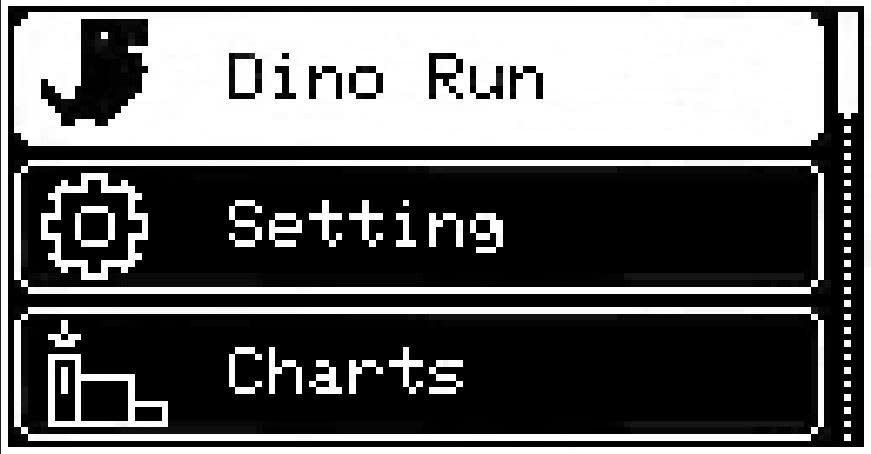
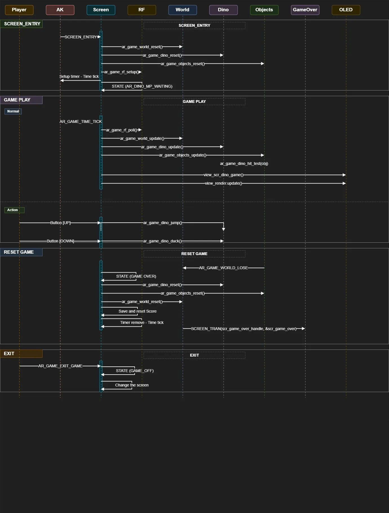
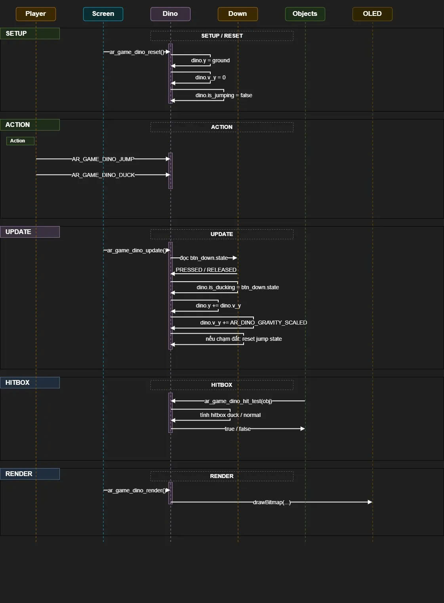
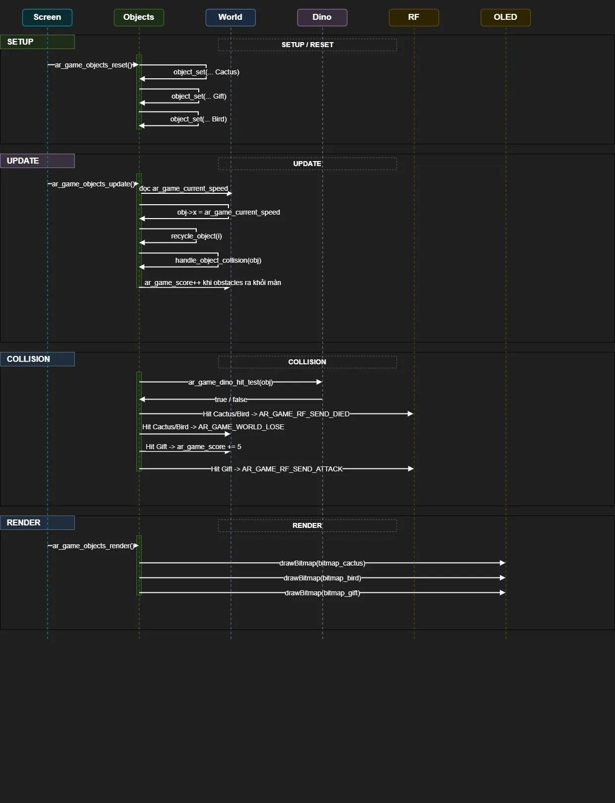
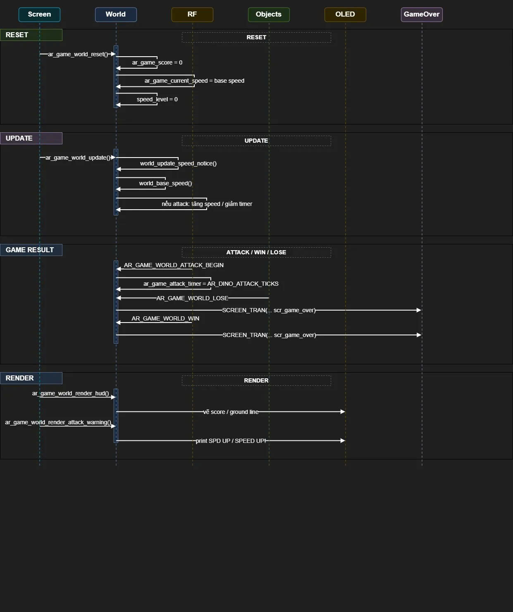
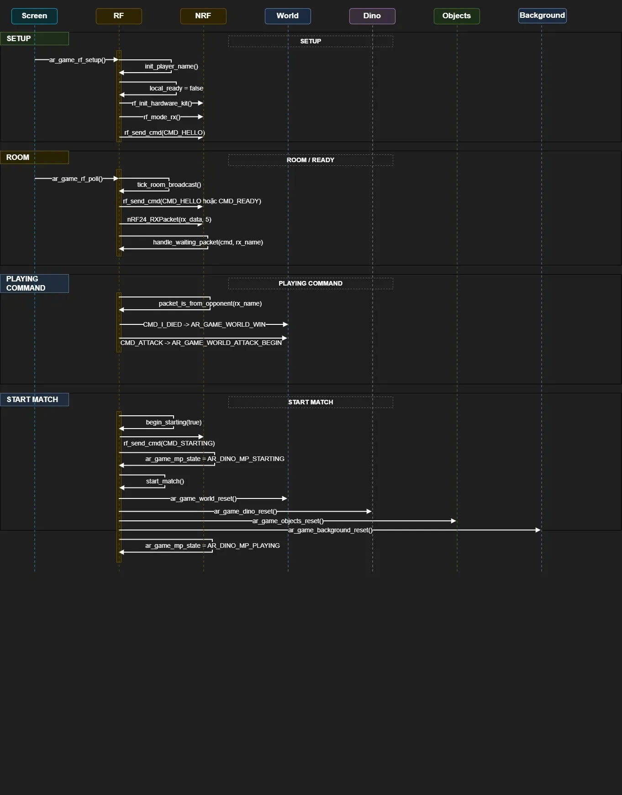
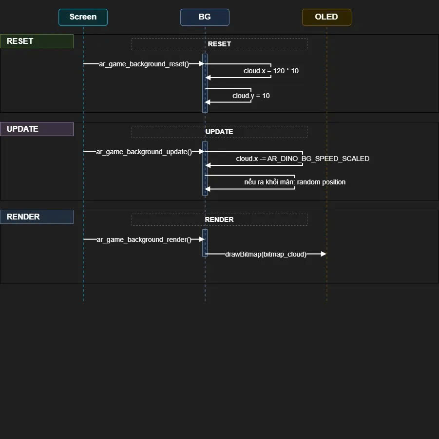
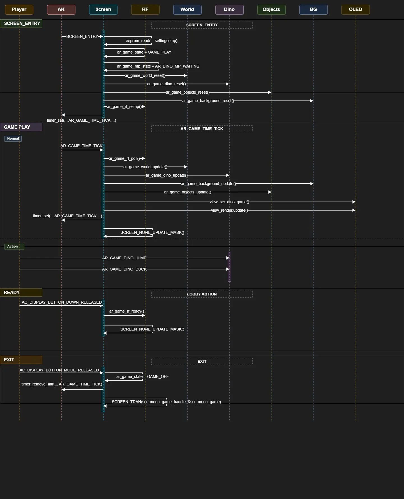

# Multiplayer Dino Game - Build on AK Embedded Base Kit

<hr>

## I. Giới thiệu

Multiplayer Dino Game là một trò chơi chạy trên **AK Embedded Base Kit**. Dự án được xây dựng để thực hành lập trình nhúng theo mô hình **event-driven**, sử dụng Task, Signal, Timer, Message, State Machine, OLED, Button, Buzzer và giao tiếp không dây **NRF24L01+**.

Game lấy cảm hứng từ Dino runner: người chơi điều khiển khủng long né chướng ngại vật, ăn hộp quà để tấn công đối thủ, và cố gắng đạt điểm cao nhất.

### 1.1 Phần cứng

<p align="center"></p>
<p align="center"><strong><em>Hình 1:</em></strong> AK Embedded Base Kit - STM32L151</p>

[AK Embedded Base Kit](https://epcb.vn/products/ak-embedded-base-kit-lap-trinh-nhung-vi-dieu-khien-mcu) là một evaluation kit dành cho các bạn học phần mềm nhúng nâng cao.

KIT tích hợp LCD **OLED 1.3"**, **3 nút nhấn**, **Buzzer**, **NRF24L01+**, RS485 và Flash ngoài. Trong dự án này, OLED dùng để hiển thị game, nút nhấn dùng để điều khiển, Buzzer dùng cho phản hồi âm thanh, và NRF24L01+ dùng cho chế độ multiplayer.

### 1.2 Mô tả trò chơi

<p align="center"></p>
<p align="center"><strong><em>Hình 2:</em></strong> Màn hình menu game</p>

#### 1.2.1 Đối tượng trong game

| Đối tượng | Tên | Mô tả |
|---|---|---|
| Khủng long | Dino | Nhân vật chính, có thể nhảy hoặc cúi. |
| Xương rồng | Cactus | Chướng ngại vật sát đất, cần nhảy qua. |
| Chim | Bird | Chướng ngại vật bay ở tầm cao/thấp, cần nhảy hoặc cúi để né. |
| Hộp quà | Gift | Vật phẩm đặc biệt, ăn được sẽ cộng điểm và gửi đòn tấn công qua RF. |
| Mây | Cloud | Cảnh nền để màn chơi có chiều sâu. |

#### 1.2.2 Cách chơi

- Khi vào game, thiết bị hiển thị phòng `DINO ROOM` và tên ngẫu nhiên dạng `[P73]`.
- Hai kit chọn cùng phòng sẽ thấy ID của nhau trong lobby.
- Nhấn `DOWN` để chuyển trạng thái của kit hiện tại sang `READY`.
- Nếu chỉ có một kit trong phòng sau khi Ready, màn hình hiện `BTN DOWN PLAY SOLO`; nhấn `DOWN` lần nữa để chơi một mình.
- Khi cả hai kit đều `READY`, hai màn hình hiện `STARTING` rồi game bắt đầu.
- Khi chơi, nhấn `UP` để Dino nhảy, giữ `DOWN` để Dino cúi.
- Game kết thúc khi Dino va vào Cactus hoặc Bird; kit chết trước hiện `YOU LOSE`, kit còn lại hiện `YOU WIN`.

#### 1.2.3 Cơ chế điểm và độ khó

- Vượt qua Cactus hoặc Bird: `+1` điểm.
- Ăn Gift: `+5` điểm và gửi lệnh `CMD_ATTACK` sang đối thủ.
- Mỗi `15` điểm, game tăng một level tốc độ và hiện thông báo `SPD UP`.
- Ở điểm cao, tốc độ tăng mạnh hơn, khoảng cách vật cản ngắn hơn, Bird xuất hiện nhiều hơn.
- Khi bị tấn công, thiết bị nhận lệnh sẽ hiện `SPEED UP!`, phát âm báo và tăng tốc tạm thời trong một khoảng thời gian ngắn.

## II. Thiết kế event-driven

**Các khái niệm trong event-driven:**

- **Event Driven:** Hệ thống gửi message để kích hoạt hành vi. Task đóng vai trò người nhận, Signal biểu diễn nội dung công việc.
- **Task:** Đơn vị xử lý một nhóm công việc cụ thể. Khi scheduler lấy được message của task, handler tương ứng sẽ được gọi.
- **Message:** Gói sự kiện được đưa vào hàng đợi. Message có thể chỉ chứa Signal hoặc chứa cả Signal và Data.
- **Signal:** Mã định danh hành động cần xử lý, ví dụ `SCREEN_ENTRY`, `AR_GAME_TIME_TICK`, `AR_GAME_RF_SEND_ATTACK`.
- **Handler:** Hàm xử lý message/signal của một task hoặc module.

### 2.1 Mục tiêu kiến trúc

Phiên bản hiện tại đã tách logic khỏi `scr_dino_game.cpp`. Screen chỉ giữ vai trò điều phối màn hình và vòng lặp timer, còn logic game nằm trong các module riêng:

| Module | Vai trò |
|---|---|
| `ar_game_dino` | Quản lý Dino, nhảy, cúi, trọng lực và hitbox. |
| `ar_game_objects` | Quản lý Cactus, Bird, Gift, spawn, recycle và va chạm. |
| `ar_game_background` | Quản lý mây và nền. |
| `ar_game_world` | Quản lý điểm, tốc độ, level, trạng thái win/lose và hiệu ứng speed up. |
| `ar_game_rf` | Quản lý NRF24L01+, room lobby, hello/ready/starting, attack và died command. |
| `scr_dino_game` | Điều phối Screen Entry, Timer Tick, Button Event và Render. |

Kiến trúc vẫn giữ số lượng task game hiện có để tránh tăng rủi ro tràn bộ nhớ, nhưng đổi vai trò thành các module Dino rõ ràng hơn.

### 2.2 Sơ đồ trình tự
**Sơ đồ trình tự** được sử dụng để mô tả trình tự của các Message và luồng tương tác giữa các đối tượng trong một hệ thống.

<p align="center"></p>
<p align="center"><strong><em>Hình 3:</em></strong> The sequence diagram</p>

### 2.3 Message và Signal chính

| Nhóm | Signal / Event | Mô tả |
|---|---|---|
| Screen | `SCREEN_ENTRY` | Khởi tạo game, đọc setting, reset module và setup RF. |
| Screen | `AR_GAME_TIME_TICK` | Tick 10ms, poll RF và chia nhịp gameplay. |
| Button | `AC_DISPLAY_BUTTON_UP_PRESSED` | Nhảy khi đang chơi. |
| Button | `AC_DISPLAY_BUTTON_UP_RELEASED` | Không dùng trong lobby mới, chỉ mask update. |
| Button | `AC_DISPLAY_BUTTON_DOWN_RELEASED` | Ready trong phòng chờ. |
| RF | `CMD_HELLO`, `CMD_READY`, `CMD_STARTING` | Hiện ID trong phòng, đồng bộ Ready và countdown Starting. |
| RF | `CMD_ATTACK`, `CMD_I_DIED` | Tấn công và báo kết thúc ván. |

### 2.4 Task

Trong code, game vẫn tái sử dụng các Task ID cũ của project để không tăng số task trong hệ thống. Tên task đã được đổi theo vai trò Dino mới.

| Task ID | Handler | Module | Vai trò |
|---|---|---|---|
| `AR_GAME_BACKGROUND_ID` | `ar_game_background_handle` | `ar_game_background` | Setup/reset/update background. |
| `AR_GAME_WORLD_ID` | `ar_game_world_handle` | `ar_game_world` | Score, speed, level, win/lose, attack timer. |
| `AR_GAME_DINO_ID` | `ar_game_dino_handle` | `ar_game_dino` | Dino physics, jump, hitbox. |
| `AR_GAME_OBJECTS_ID` | `ar_game_objects_handle` | `ar_game_objects` | Cactus/Bird/Gift movement, spawn, collision. |
| `AR_GAME_RF_ID` | `ar_game_rf_handle` | `ar_game_rf` | NRF24 command, lobby, attack/died. |
| `AR_GAME_SCREEN_ID` | `scr_dino_game_handle` | `scr_dino_game` | Screen event, timer tick, button dispatch, render frame. |

**Ghi chú hiệu năng:** Trong gameplay, các hàm update chính được gọi trực tiếp từ `scr_dino_game` để tránh overhead message queue và tránh tụt FPS khi spam nút. Các handler task vẫn được giữ cho setup/reset/RF command và để kiến trúc event-driven rõ ràng.

### 2.5 Signal theo module

| Module | Signal | Mô tả |
|---|---|---|
| Screen | `SCREEN_ENTRY` | Đọc setting, reset module, setup RF, bật timer tick. |
| Screen | `AR_GAME_TIME_TICK` | Poll RF, chia nhịp gameplay, update và render frame. |
| Dino | `AR_GAME_DINO_SETUP` | Reset Dino về vị trí mặt đất. |
| Dino | `AR_GAME_DINO_UPDATE` | Cập nhật cúi, nhảy, trọng lực. |
| Dino | `AR_GAME_DINO_JUMP` | Bắt đầu nhảy nếu Dino đang ở mặt đất. |
| Dino | `AR_GAME_DINO_RESET` | Reset Dino sau start/restart. |
| Objects | `AR_GAME_OBJECTS_SETUP` | Tạo mảng object ban đầu. |
| Objects | `AR_GAME_OBJECTS_UPDATE` | Di chuyển, recycle, kiểm tra collision. |
| Objects | `AR_GAME_OBJECTS_RESET` | Reset toàn bộ object. |
| World | `AR_GAME_WORLD_UPDATE` | Tính tốc độ, level, timer thông báo. |
| World | `AR_GAME_WORLD_ATTACK_BEGIN` | Bắt đầu hiệu ứng bị attack. |
| World | `AR_GAME_WORLD_LOSE` | Chuyển trạng thái thua và qua Game Over. |
| World | `AR_GAME_WORLD_WIN` | Chuyển trạng thái thắng và qua Game Over. |
| Background | `AR_GAME_BACKGROUND_UPDATE` | Di chuyển cloud nền. |
| RF | `AR_GAME_RF_SETUP` | Khởi tạo tên người chơi và NRF24. |
| RF | `AR_GAME_RF_POLL` | Đọc packet RF nếu có. |
| RF | `AR_GAME_RF_READY` | Đặt `local_ready`, gửi `CMD_READY`, bắt đầu Starting nếu đủ 2 Ready. |
| RF | `AR_GAME_RF_ACCEPT` | Giữ tương thích, hiện gọi cùng logic với `ar_game_rf_ready()`. |
| RF | `AR_GAME_RF_SEND_ATTACK` | Gửi `CMD_ATTACK`. |
| RF | `AR_GAME_RF_SEND_DIED` | Gửi `CMD_I_DIED`. |

### 2.6 Bitmap và tài nguyên

| Bitmap | File | Kích thước | Chức năng |
|---|---|---:|---|
| `bitmap_dino` | `screens_bitmap.cpp` | 16x16 | Dino đứng/chạy/nhảy. |
| `bitmap_dino_duck` | `screens_bitmap.cpp` | 16x16 | Dino cúi. |
| `bitmap_cactus` | `screens_bitmap.cpp` | 16x16 | Cactus. |
| `bitmap_bird` | `screens_bitmap.cpp` | 16x8 | Bird. |
| `bitmap_gift` | `screens_bitmap.cpp` | 8x8 | Gift attack. |
| `bitmap_cloud` | `screens_bitmap.cpp` | 16x16 | Cloud background. |

## III. Sequence chi tiết cho từng đối tượng

### 3.1 Dino

<p align="center"></p>
<p align="center"><strong><em>Hình 4:</em></strong> Dino sequence diagram</p>

**Tóm tắt nguyên lý:** Dino nhận hành động nhảy từ button event, nhận trạng thái cúi từ `btn_down.state`, tự cập nhật trọng lực theo nhịp gameplay và cung cấp hàm hitbox cho module Objects.

### 3.2 Objects: Cactus, Bird, Gift

<p align="center"></p>
<p align="center"><strong><em>Hình 5:</em></strong> Objects sequence diagram</p>

**Tóm tắt nguyên lý:** Objects chịu trách nhiệm tạo nhịp chơi chính: di chuyển vật cản, recycle vật cản, tăng điểm, kiểm tra va chạm và gửi event sang World/RF.

### 3.3 World

<p align="center"></p>
<p align="center"><strong><em>Hình 6:</em></strong> World sequence diagram</p>

**Tóm tắt nguyên lý:** World không trực tiếp điều khiển object, nhưng cung cấp tốc độ hiện tại và trạng thái game. Đây là module quyết định độ khó theo điểm, setting và attack.

### 3.4 RF / Multiplayer

<p align="center"></p>
<p align="center"><strong><em>Hình 7:</em></strong> RF sequence diagram</p>

**Tóm tắt nguyên lý:** RF quản lý cả lobby và command trong trận. Mỗi gói gửi 5 byte gồm command và tên người gửi để tránh nhận nhầm packet không thuộc phiên hiện tại.

### 3.5 Background

<p align="center"></p>
<p align="center"><strong><em>Hình 8:</em></strong> Background sequence diagram</p>

**Tóm tắt nguyên lý:** Background chỉ xử lý cloud nền để game có chiều sâu, không ảnh hưởng collision.

### 3.6 Screen

<p align="center"></p>
<p align="center"><strong><em>Hình 9:</em></strong> Screen sequence diagram</p>

**Tóm tắt nguyên lý:** Screen là nơi nối các module lại với nhau. Screen không giữ logic vật lý, spawn hay RF packet; nó chỉ gọi đúng module theo đúng thời điểm.

## IV. Cấu trúc dữ liệu

Các struct chính được đặt trong `ar_game_common.h`.

```cpp
typedef struct {
    int16_t y;
    int16_t v_y;
    bool is_jumping;
    bool is_ducking;
} ar_game_dino_t;

typedef struct {
    int32_t x;
    int16_t y;
    uint8_t w;
    uint8_t h;
    uint8_t type;
    bool active;
} ar_game_object_t;

typedef struct {
    int32_t x;
    int16_t y;
    uint8_t w;
    uint8_t h;
} ar_game_bg_t;
```

| Biến | Module | Chức năng |
|---|---|---|
| `dino` | `ar_game_dino` | Trạng thái Dino hiện tại. |
| `ar_game_objects[4]` | `ar_game_objects` | Danh sách Cactus, Bird, Gift. |
| `ar_game_cloud` | `ar_game_background` | Mây nền. |
| `ar_game_score` | `ar_game_world` | Điểm hiện tại. |
| `ar_game_current_speed` | `ar_game_world` | Tốc độ chạy hiện tại. |

## V. Luồng code chính

### 5.1 Screen Entry

`scr_dino_game.cpp` chịu trách nhiệm khởi tạo màn chơi.

```cpp
case SCREEN_ENTRY: {
    eeprom_read(EEPROM_SETTING_START_ADDR, (uint8_t*)&settingsetup, sizeof(settingsetup));
    ar_game_state = GAME_PLAY;
    ar_game_mp_state = AR_DINO_MP_WAITING;
    gameplay_tick_divider = 0;

    ar_game_world_reset();
    ar_game_dino_reset();
    ar_game_objects_reset();
    ar_game_background_reset();
    ar_game_rf_setup();

    timer_set(AC_TASK_DISPLAY_ID, AR_GAME_TIME_TICK, 10, TIMER_ONE_SHOT);
}
break;
```

### 5.2 Gameplay Tick

Timer vẫn chạy 10ms để RF phản hồi nhanh, nhưng gameplay được chia nhịp để tốc độ và trọng lực không quá nhanh.

```cpp
case AR_GAME_TIME_TICK: {
    ar_game_rf_poll();

    if (ar_game_mp_state == AR_DINO_MP_PLAYING) {
        gameplay_tick_divider++;
        if (gameplay_tick_divider >= 2) {
            gameplay_tick_divider = 0;

            ar_game_world_update();
            ar_game_dino_update();
            ar_game_background_update();
            ar_game_objects_update();

            view_scr_dino_game();
            view_render.update();
        }
    }

    timer_set(AC_TASK_DISPLAY_ID, AR_GAME_TIME_TICK, 10, TIMER_ONE_SHOT);
    SCREEN_NONE_UPDATE_MASK();
}
break;
```

### 5.3 Dino Physics và Hitbox

```cpp
void ar_game_dino_update() {
    dino.is_ducking = (btn_down.state == BUTTON_SW_STATE_PRESSED);

    if (dino.is_jumping) {
        dino.y += dino.v_y;
        dino.v_y += AR_DINO_GRAVITY_SCALED;

        if (dino.y >= (AR_DINO_GROUND_Y_SCALED - (AR_DINO_H * 10))) {
            dino.y = AR_DINO_GROUND_Y_SCALED - (AR_DINO_H * 10);
            dino.is_jumping = false;
            dino.v_y = 0;
        }
    }
}

bool ar_game_dino_hit_test(const ar_game_object_t* obj) {
    int16_t dy = dino.y / 10;
    int16_t dino_hit_y = dy;
    int16_t dino_hit_h = AR_DINO_H;
    int16_t obj_x = obj->x / 10;

    if (dino.is_ducking) {
        dino_hit_y = dy + 6;
        dino_hit_h = 10;
    }

    bool hit_x = (AR_DINO_X + AR_DINO_W - 4 > obj_x) &&
                 (AR_DINO_X + 2 < obj_x + obj->w);
    bool hit_y = (dino_hit_y + dino_hit_h > obj->y + 2) &&
                 (dino_hit_y + 2 < obj->y + obj->h);

    return hit_x && hit_y;
}
```

### 5.4 Tăng độ khó

`ar_game_world_update()` tính tốc độ hiện tại dựa trên setting và điểm số.

```cpp
void ar_game_world_update() {
    int32_t start_speed_bonus = (settingsetup.num_arrow - 1) * AR_DINO_SETTING_SPEED_STEP;
    int32_t base_speed = AR_DINO_BASE_SPEED_SCALED + start_speed_bonus;
    uint8_t next_speed_level = ar_game_score / AR_DINO_SCORE_STEP;

    if (next_speed_level > speed_level) {
        speed_level = next_speed_level;
        speed_up_notice_timer = 90;
    }

    base_speed += (ar_game_score / AR_DINO_SCORE_STEP) * AR_DINO_SPEED_STEP;
    if (base_speed > AR_DINO_MAX_BASE_SPEED) {
        base_speed = AR_DINO_MAX_BASE_SPEED;
    }

    ar_game_current_speed = base_speed;
}
```

Cơ chế hiện tại:

| Mốc điểm | Ảnh hưởng |
|---|---|
| Mỗi 15 điểm | Tăng speed level và hiện `SPD UP`. |
| Điểm càng cao | Khoảng cách vật cản càng ngắn. |
| Điểm càng cao | Bird xuất hiện nhiều hơn. |
| Bị tấn công | Tăng tốc tạm thời và hiện `SPEED UP!`. |

### 5.5 RF Multiplayer

Mỗi gói RF gồm command và tên người gửi.

```cpp
static void rf_send_cmd(uint8_t cmd) {
    static uint8_t tx_buf[5];
    tx_buf[0] = cmd;
    tx_buf[1] = my_name[0];
    tx_buf[2] = my_name[1];
    tx_buf[3] = my_name[2];
    tx_buf[4] = '\0';

    nRF24_TXMode(5, 15, current_rf_channel, nRF24_DataRate_1Mbps,
                 nRF24_TXPower_0dBm, nRF24_CRC_2byte,
                 nRF24_PWR_Up, RF_ADDR, 5);
    nRF24_TXPacket(tx_buf, 5);
    rf_mode_rx();
}
```

Các command chính:

| Command | Ý nghĩa |
|---|---|
| `CMD_HELLO` | Broadcast ID để các kit cùng phòng thấy nhau. |
| `CMD_READY` | Báo kit hiện tại đã Ready. |
| `CMD_STARTING` | Đồng bộ màn Starting trước khi chạy gameplay. |
| `CMD_START` | Command cũ vẫn được nhận để tương thích. |
| `CMD_ATTACK` | Gift attack, ép đối thủ speed up. |
| `CMD_I_DIED` | Báo mình đã thua. |

## VI. Hiển thị và âm thanh

### 6.1 Bitmap

Bitmap được lưu trong `screens_bitmap.cpp` dưới dạng mảng `PROGMEM`.

| Bitmap | Kích thước | Chức năng |
|---|---:|---|
| `bitmap_dino` | 16x16 | Dino đứng/chạy/nhảy. |
| `bitmap_dino_duck` | 16x16 | Dino cúi. |
| `bitmap_cactus` | 16x16 | Xương rồng. |
| `bitmap_bird` | 16x8 | Chim. |
| `bitmap_gift` | 8x8 | Hộp quà. |
| `bitmap_cloud` | 16x16 | Mây nền. |

### 6.2 Render gameplay

Screen gọi các module render theo thứ tự cố định.

```cpp
static void render_gameplay() {
    ar_game_world_render_hud();
    ar_game_background_render();
    ar_game_objects_render();
    ar_game_dino_render();
    ar_game_world_render_attack_warning();
}

void view_scr_dino_game() {
    view_render.clear();

    if (ar_game_mp_state == AR_DINO_MP_PLAYING) {
        render_gameplay();
    }
    else {
        ar_game_rf_render_lobby();
    }
}
```

### 6.3 Âm thanh

| Tone | Sử dụng |
|---|---|
| `tones_cc` | Ready, nhặt Gift, xác nhận thao tác. |
| `tones_startup` | Bắt đầu game hoặc bị attack. |
| `tones_3beep` | Game Over khi thua. |

## VII. Build và nạp firmware

Build application:

```bash
cd application
make all
```

File firmware sau build:

```text
application/build_ak-base-kit-stm32l151-application/ak-base-kit-stm32l151-application.bin
```

Nạp qua bootloader AK:

```bash
make flash dev=/dev/ttyUSB0
```

Nạp qua ST-Link:

```bash
make flash
```

## VIII. Ghi chú triển khai

- Public screen của game hiện dùng tên `scr_dino_game` để đồng bộ với Dino code.
- Menu không bị thay đổi trong refactor.
- `SCREEN_NONE_UPDATE_MASK()` được dùng để tránh screen manager tự render lại sau các message nút, giúp spam nút nhảy không làm tụt FPS.
- RF vẫn poll mỗi 10ms, còn gameplay physics chạy theo nhịp chia 20ms để tốc độ và trọng lực ổn định hơn trên kit thật.
